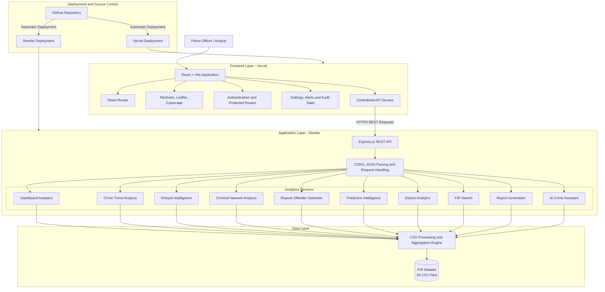
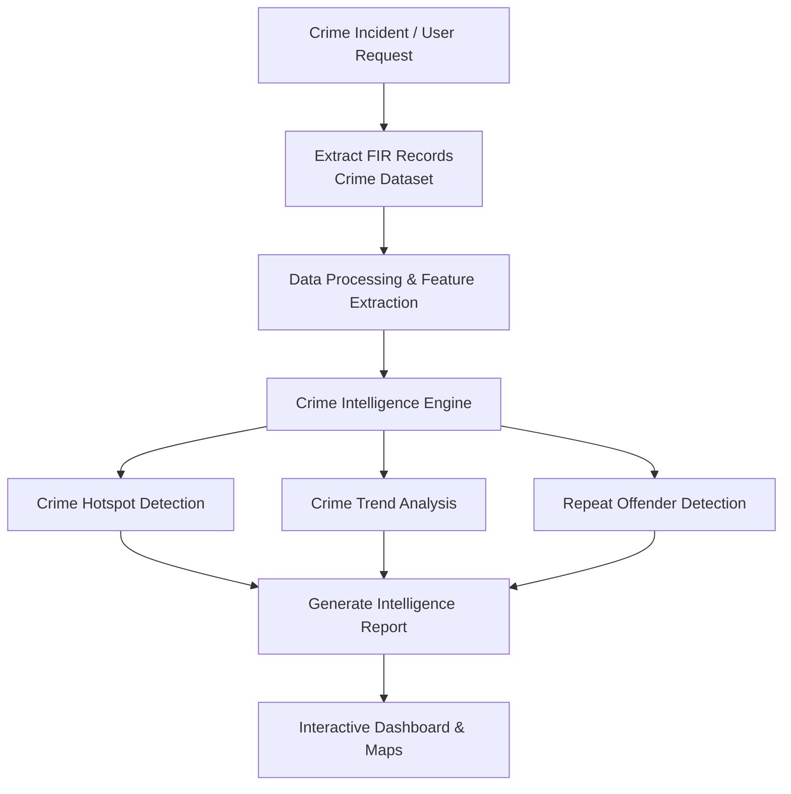

# NETRA AI

## AI-Powered Crime Intelligence Platform for State Police

NETRA AI is an intelligent crime analytics platform developed for the **Smart India Hackathon 2026**. The platform transforms raw FIR records into actionable intelligence through interactive visualisations, predictive analytics, criminal network exploration, hotspot identification, and an AI-powered investigation assistant.

Rather than functioning as a traditional record management system, NETRA AI focuses on assisting investigators and decision-makers by extracting operational insights from historical FIR data. The application processes structured CSV datasets to generate district-level intelligence, identify crime trends, detect repeat offenders, forecast crime patterns, and support evidence-driven policing.

**Live Deployed Prototype:** [https://NETRA-snowy.vercel.app](https://NETRA-snowy.vercel.app)

> **Product intent:** For the full vision, innovation brief, milestoned roadmap and requirements breakdown, see **[`PRD.md`](./PRD.md)**. This README documents what the product is, how it works, and how to run and deploy it.

---

# Table of Contents

- Overview
- Product Vision & Operating Modes
- Objectives
- Key Features
- System Architecture
- Technology Stack
- Project Structure
- Core Modules
- Dataset Processing
- REST API
- Installation
- Running the Project
- Deployment
- Security
- Performance Considerations
- Limitations & Known Issues
- Future Scope
- Contributors
- License

---

# Overview

Law enforcement agencies collect vast amounts of FIR data every day. While these datasets contain valuable investigative information, extracting meaningful intelligence from them is often difficult and time-consuming.

NETRA AI addresses this challenge by providing a unified analytical platform capable of:

- analysing crime distribution
- identifying crime hotspots
- detecting repeat offenders
- discovering criminal associations
- forecasting crime trends
- assisting investigators through natural-language queries
- generating district-wise operational intelligence

The platform is designed around real FIR datasets and performs all analytics dynamically without requiring a traditional relational database.

---

# Product Vision & Operating Modes

This project was developed and documented using three working modes that shaped both the roadmap and the architecture:

| Mode | What it drove |
| :--- | :--- |
| **`MODE: DEEP_THINK`** | Vision: innovation brief, feature trade-off matrix, Lean MVP definition, and the "why" behind each capability. |
| **`MODE: DEEP_WORK`** | Delivery: decomposition into milestones with acceptance criteria, dependencies, review gates, and incremental commits. |
| **`MODE: ARCHITECTURE_REVIEW`** | Engineering: scalability, maintainability, security, observability, and cost analysis — with a documented path from v1 → v2. |

The distillation of these modes lives in **[`PRD.md`](./PRD.md)**. The recommended path is a **Lean MVP** (dashboard, hotspots, trends, network, repeat offenders, predictions, search, reports, resources, alerts, audit) with the **Innovator's Path** (real LLM copilot, anomaly radar, auto-briefs) reserved for v1.5.

---

# Objectives

The primary objectives of NETRA AI are:

- Transform raw FIR datasets into operational intelligence.
- Provide investigators with interactive analytical dashboards.
- Identify emerging crime patterns across districts.
- Detect criminal relationships and repeat offenders.
- Enable predictive crime analysis using historical trends.
- Assist police personnel through an AI-powered investigation assistant.
- Deliver a modern, scalable and responsive investigative platform.

---

# Platform Previews

## Core Intelligence Dashboard

<table>
<tr>
<td align="center" width="50%">

### Crime Intelligence Dashboard


</td>

<td align="center" width="50%">

### AI Crime Assistant


</td>
</tr>

<tr>
<td align="center">

### Crime Hotspot Map


</td>

<td align="center">

### Crime Trends


</td>
</tr>
</table>

---

## Investigation Intelligence

<table>
<tr>
<td align="center" width="50%">

### Criminal Network Analysis


</td>

<td align="center" width="50%">

### Repeat Offender Detection


</td>
</tr>

<tr>
<td align="center">

### Predictive Intelligence


</td>

<td align="center">

### District Analysis


</td>
</tr>
</table>

---

## Operational Intelligence

<table>
<tr>
<td align="center" width="50%">

### Case Search


</td>

<td align="center" width="50%">

### Alerts & Notifications


</td>
</tr>

<tr>
<td align="center">

### Report Generation


</td>

<td align="center">

### Dataset Resource Explorer


</td>
</tr>
</table>

---

## User Experience

<table>
<tr>
<td align="center" width="50%">

### User Profile & Settings


</td>

<td align="center" width="50%">

### Authentication


</td>
</tr>
</table>

---

# Key Features

## Crime Intelligence Dashboard

Provides an executive overview of crime statistics including:

- Total registered cases
- Active investigations
- Heinous offences
- Highest crime volume district
- Crime category distribution
- Severity distribution
- Monthly crime trends

---

## AI Crime Assistant

An investigation assistant capable of answering dataset-grounded queries.

Examples include:

- District with the highest crime rate
- Leading crime categories
- Repeat offender analysis
- FIR search assistance
- Investigation recommendations
- Dataset summarisation

> **Note on scope:** the assistant is a **rule-based, dataset-grounded** matcher in v1, with a documented integration point to connect a real LLM (Gemini) later without changing the frontend contract.

---

## Crime Hotspot Mapping

Interactive GIS visualisation showing:

- Crime concentration
- District hotspots
- Spatial crime distribution
- High-risk locations

Built using Leaflet.

---

## Crime Trend Analysis

Analyses historical crime behaviour through:

- Monthly trends
- Category comparison
- Severity comparison
- Resolution statistics

---

## Criminal Network Analysis

Visualises relationships between offenders and linked criminal activity using an interactive graph built with Cytoscape.js.

---

## Repeat Offender Detection

Automatically identifies:

- Individuals appearing in multiple FIRs
- High-frequency offenders
- District-level offender statistics

---

## Predictive Intelligence

Forecasts future crime activity based on historical FIR patterns.

Outputs include:

- High-risk districts
- Expected crime volume
- Forecasted growth
- Operational risk indicators

> **Honest labelling:** the v1 forecast is a **3-month moving-average heuristic** with percentile-based risk thresholds. It is an operational indicator, not a rigorous ML model.

---

## District Analytics

Provides comprehensive district-wise intelligence including:

- Registered FIRs
- Resolved cases
- Pending investigations
- Heinous offences
- Crime comparison

---

## Case Search

Fast searching across FIR records by:

- Case number
- District
- Accused
- Keywords

---

## Reports

Generate analytical reports in multiple formats including:

- CSV
- JSON

---

## Resource Explorer

Interactive dataset explorer displaying:

- Dataset information
- Column metadata
- Record counts
- Schema summary

---

## System Architecture


---

## Operational Data Flowchart



---

# Technology Stack

## Frontend

- React
- Vite
- React Router
- Tailwind CSS
- Recharts
- React Leaflet
- Cytoscape.js

## Backend

- Node.js
- Express.js
- CSV Parser
- File System API
- CORS

## Data Source

- FIR Dataset
- 29 CSV files

---

# Project Structure

```
NETRA/
├── backend/                         Express.js backend and analytics API
│   ├── data/                        FIR CSV datasets
│   ├── node_modules/                Backend dependencies
│   ├── .env.example                 Backend environment variable template
│   ├── package.json                 Backend dependencies and scripts
│   ├── package-lock.json            Backend dependency lock file
│   └── server.js                    REST API, CSV processing and analytics engine
│
├── functions/                       Catalyst function configuration
│
├── public/                          Static frontend assets
│
├── src/                             React application source
│   ├── components/                  Reusable user interface components
│   │   ├── common/                  PageHeader, PlaceholderPage, DashboardTour
│   │   └── layout/                  Sidebar, Topbar
│   ├── context/                     Global React context providers
│   │   └── AuthContext.jsx          Authentication state and session handling
│   ├── hooks/                       Reusable React hooks
│   │   ├── useApi.js                API request, loading and error-state management
│   │   └── useDateRange.js          Shared date-range filter state
│   ├── layouts/                     Shared application layouts
│   │   └── DashboardLayout.jsx      Main authenticated dashboard layout
│   ├── pages/                       Application screens
│   │   ├── AIChatbot.jsx            Dataset-grounded crime investigation assistant
│   │   ├── Alerts.jsx               Operational and high-severity alerts
│   │   ├── AuditLogs.jsx            Local application activity history
│   │   ├── CaseSearch.jsx           FIR, accused and district search
│   │   ├── CrimeTrends.jsx          Historical crime trend visualisation
│   │   ├── CriminalNetwork.jsx      Criminal relationship network graph
│   │   ├── Dashboard.jsx            Crime intelligence overview
│   │   ├── DistrictAnalysis.jsx     District-wise case and resolution analytics
│   │   ├── HotspotMap.jsx           Geospatial crime hotspot visualisation
│   │   ├── Login.jsx                User authentication page
│   │   ├── Predictions.jsx          Predictive crime intelligence
│   │   ├── Profile.jsx              User profile information
│   │   ├── RepeatOffenders.jsx      Repeat offender identification
│   │   ├── Reports.jsx              Dataset report generation and export
│   │   ├── Resources.jsx            Dataset schema and file explorer
│   │   └── Settings.jsx             Application preferences and configuration
│   │
│   ├── auth/                        ProtectedRoute
│   ├── services/                    Frontend service layer
│   │   ├── api.js                   Centralised backend API client
│   │   └── aiService.jsx            Assistant reply layer (mock in v1)
│   ├── utils/                       Utility functions and local storage helpers
│   │   ├── auditLogger.js           Client-side audit activity logger
│   │   └── filterByDateRange.js     Date-range filtering helper
│   ├── config/                      navigation.js nav inventory
│   ├── data/                        Sample case data
│   ├── App.jsx                      Main route and application configuration
│   ├── index.css                    Global styling
│   └── main.jsx                     React application entry point
│
├── .github/workflows/               keep-render-awake.yml (health ping every 5 min)
├── .catalyst/                       Catalyst deployment config
├── .env.example                     Frontend environment variable template
├── .gitignore                       Git exclusion rules
├── catalyst.json                    Catalyst deployment configuration
├── cli-config.json                  Catalyst CLI configuration
├── index.html                       Vite HTML entry point
├── package.json                     Frontend dependencies and scripts
├── PRD.md                           Product Requirements Document
├── README.md                        Project documentation
├── vercel.json                      Vercel SPA routing configuration
└── vite.config.js                   Vite build and development configuration
```

---

# Dataset Processing

Unlike traditional applications that rely on SQL databases, NETRA AI processes structured CSV datasets directly.

The backend dynamically:

- Reads FIR datasets
- Cleans records
- Aggregates statistics
- Calculates district summaries
- Detects hotspots
- Builds criminal relationship graphs
- Computes predictive metrics
- Generates dashboard analytics

No manual preprocessing is required.

---

# REST API

| Endpoint | Description |
|-----------|-------------|
| `/api/health` | Health check (ok, caseCount, districtCount) |
| `/api/lookups` | Master data (districts, crime heads, statuses, gravity) |
| `/api/dashboard` | Dashboard metrics (filters: districtId, crimeHeadId, statusId, from, to) |
| `/api/crime-trends` | Crime trend analytics |
| `/api/hotspots` | Hotspot analysis (points + clusters) |
| `/api/network` | Criminal network graph (`maxCases` 20–500) |
| `/api/repeat-offenders` | Repeat offender analysis (`minCases`) |
| `/api/predictive` | Predictive intelligence |
| `/api/districts` | District listing |
| `/api/district-analytics/:id` | District insights (404 if unknown) |
| `/api/search` | FIR search (`q`) |
| `/api/reports` | Report generation |
| `/api/resources` | Dataset schema explorer |
| `/api/alerts` | Alerts |
| `/api/assistant` | AI assistant (rule-based, Gemini-ready) |

---

# Installation

Clone the repository

```bash
git clone https://github.com/barsha20061001/NETRA
cd NETRA
```

Install frontend dependencies

```bash
npm install
```

Install backend dependencies

```bash
cd backend
npm install
```

---

# Running the Application

Start the backend

```bash
cd backend
npm start
```

Backend URL

```
http://localhost:5000
```

Start the frontend

```bash
npm run dev
```

Frontend URL

```
http://localhost:5173
```

---

# Environment Variables

Frontend

```
VITE_API_BASE_URL=http://localhost:5000
```

Production

```
VITE_API_BASE_URL=https://NETRA-ai-api.onrender.com
```

> **Config note:** keep the backend port and `VITE_API_BASE_URL` consistent. Some older examples reference port `3000`; the backend default is **PORT=5000** (see `backend/.env.example`).

---

# Deployment

## Backend

- Render (`NETRA-ai-api.onrender.com`)
- A GitHub Actions workflow (`keep-render-awake.yml`) pings `/api/health` every 5 minutes to keep the free instance awake.

## Frontend

- Vercel (`NETRA-snowy.vercel.app`)
- SPA routing handled via `vercel.json` rewrites.

The frontend communicates with the backend through the `VITE_API_BASE_URL` environment variable.

---

# Security

The platform includes:

- Protected application routes
- Configurable CORS policy (allowlist: `localhost:5173`, `NETRA-snowy.vercel.app`)
- Environment-based configuration
- Input validation on query parameters
- Client-side authentication

> **Important limitation:** authentication in v1 is **demo-only** — a tokenless client-side session using hardcoded credentials (`analyst@NETRA.ai` / `NETRA@123`). It is sufficient for the Datathon prototype but **must not** be used with real data in production. Real authentication + role-based access control is the first v1.5 priority.

---

# Performance Considerations

The backend performs in-memory aggregation over CSV datasets and exposes lightweight REST endpoints for the frontend. Expensive computations are performed once per request, allowing the client to remain responsive while rendering interactive visualisations.

**Architecture review note:** the current backend re-parses CSV files on each request (and `/api/resources` reads all 29 files per call). This is acceptable at the current dataset scale (~2.5k cases), but a lightweight in-memory cache with a TTL is the recommended first performance optimisation. See `PRD.md` §8 for the full review and migration path.

---

# Limitations & Known Issues

Documented honestly so reviewers and contributors know where to look:

1. **No relational database** — all analytics are computed in-memory from CSVs; not horizontally scalable (intentional for v1).
2. **Mocked AI assistant** — rule-based matcher fronted by a simulated delay; the real LLM (Gemini) integration is a documented, separable next step.
3. **Demo authentication** — client-side only; not production-grade (see Security above).
4. **Client-side audit logs** — stored in `localStorage`; forgeable and suitable only for demo demonstration.
5. **Backend single-file shape** — `server.js` is ~800+ lines and contains a known double `res.json` in `/api/dashboard` plus a duplicate `/api/health` definition; these are flagged for refactor into route modules.
6. **Forecast is a heuristic** — a 3-month moving average, not a learned model; labelled accordingly in the UI.

---

# Future Enhancements

Potential future improvements include:

- Machine learning-based crime forecasting
- Real-time FIR ingestion
- Role-based access control (real authentication)
- Advanced GIS heatmap clustering
- Natural language FIR summarisation (real LLM copilot, anomaly radar, auto-briefs)
- Voice-enabled investigation assistant
- Mobile application
- PDF report generation
- Real-time notifications
- Database support for large-scale deployments

See **[`PRD.md`](./PRD.md)** for the full milestoned roadmap (v1 → v1.5 → v2), acceptance criteria, and the `ARCHITECTURE_REVIEW` migration path.

---

# Contributors

Developed as part of the **State Police Datathon 2026**.

~ **Barsha**

---

# License

This project has been developed for educational, research and hackathon purposes. The FIR dataset belongs to its respective owners and is used solely for analytical demonstration within the scope of the competition.
